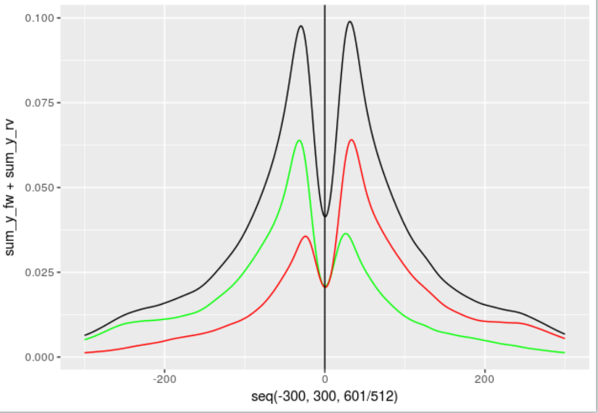

# ATACfactor C++

Usage:

```
 ./main [--nreads NREADS] [--npeaks NPEAKS] [--bw BW] [--absthresh ABSTHRESH]
        [--relthresh RELTHRESH] [--prominence PROMINENCE] [--minreads MINREADS] [--threads THREADS] INPUT
```

Example of an aggregate plot (using code from *this* repo) for single-footprints:


